# Metrics App Deployment

# Root Project Directory
```text
.
├── README.md                          # Project documentation with setup, usage, and findings

# ArgoCD Manifests
├── argocd
│   └── metrics-app.yaml              # ArgoCD Application manifest to deploy the metrics app using the Helm chart

# Helm Chart for metrics-app
├── helm
│   └── metrics-app
│       ├── Chart.yaml                # Helm chart metadata file (name, version, description)
│       ├── templates                 # Kubernetes manifest templates for deployment
│       │   ├── deployment.yaml       # Deployment resource for the app container
│       │   ├── ingress.yaml          # Ingress resource to expose /counter endpoint externally
│       │   ├── secret.yaml           # Kubernetes Secret to store the PASSWORD securely
│       │   └── service.yaml          # Service resource to expose the app within the cluster
│       └── values.yaml               # Default configuration values for the chart

# Screenshot Evidence of Setup & Behavior
├── images
│   ├── 1.png to 12.png               # Screenshots showing ArgoCD, terminal, app behavior, debugging steps, etc.

# KIND Cluster Setup Scripts and Config
└── kind
    ├── cluster-config.yaml           # KIND cluster config with port mappings for Ingress (80/443 to localhost)
    ├── install-argocd.sh             # Script to install ArgoCD in the KIND cluster
    └── install-ingress-nginx.sh      # Script to install NGINX Ingress controller for exposing the app
```
## Setup Instructions

1. Create a KIND cluster
```bash
kind create cluster --name metrics-cluster --config cluster-config.yaml
```

2. Install ArgoCD
```bash
./kind/install-argocd.sh
```
Access the argocd dashboard

3. Install NGINX Ingress Controller
```bash
./kind/install-ingress-nginx.sh
```

4. Port-forward
```bash
kubectl port-forward svc/argocd-server -n argocd 8081:443
```

5. Access the ArgoCD Dashboard and connect github repository to ArgoCD then create application from it or apply the below ArgoCD application
```bash
kubectl apply -f argocd/metrics-app.yaml
```

6. Access the app:
```bash

kubectl port-forward svc/metrics-app 8080:8080
curl http://localhost/counter
```

7. Loop test

```bash
for i in $(seq 1 20); do curl -s http://localhost/counter; done
```

8. All Screenshots

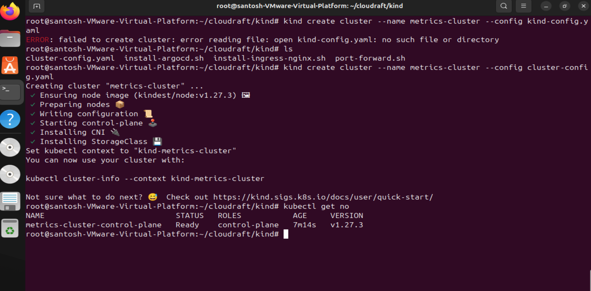
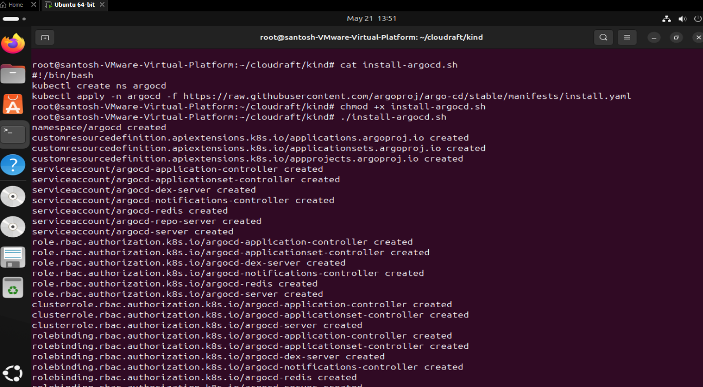
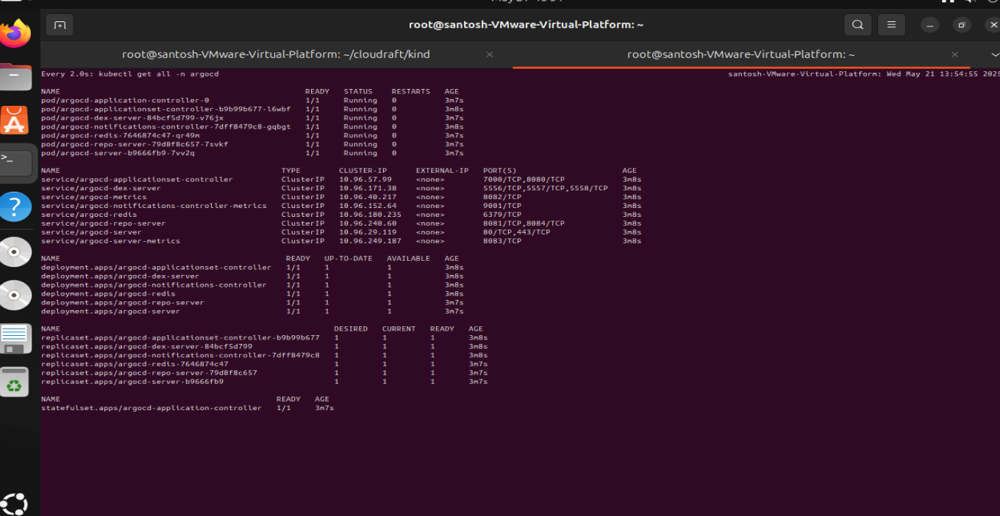
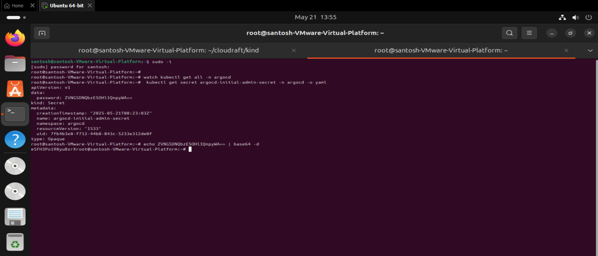

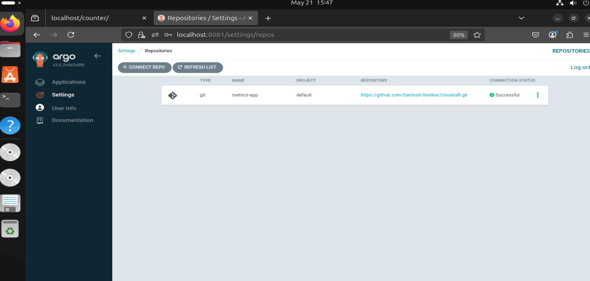
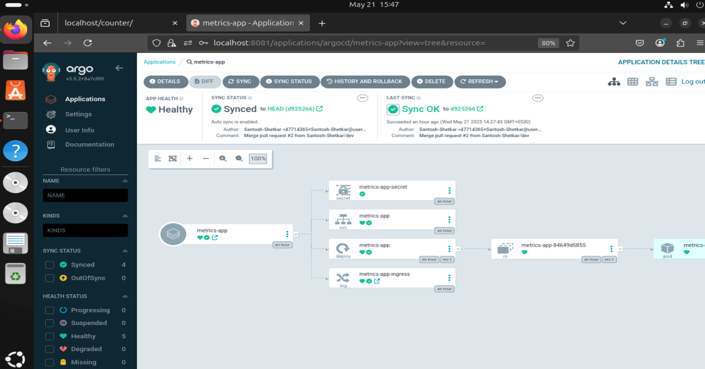
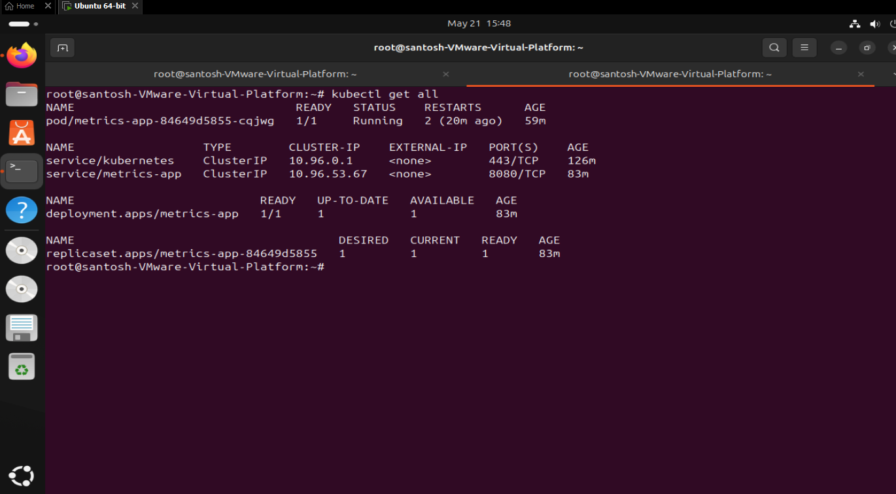
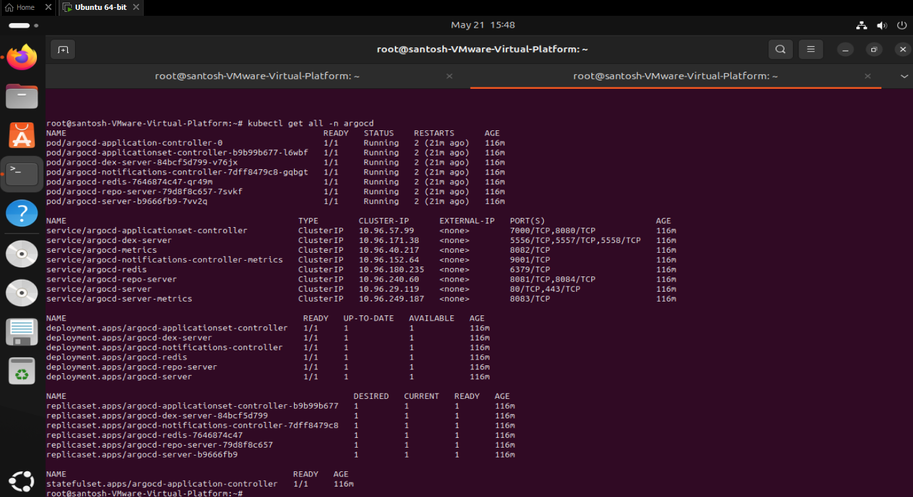
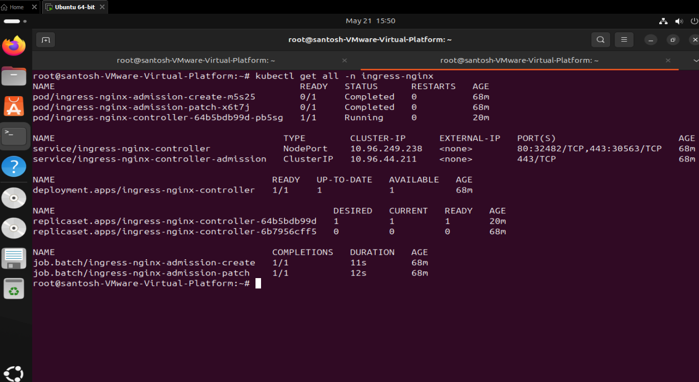
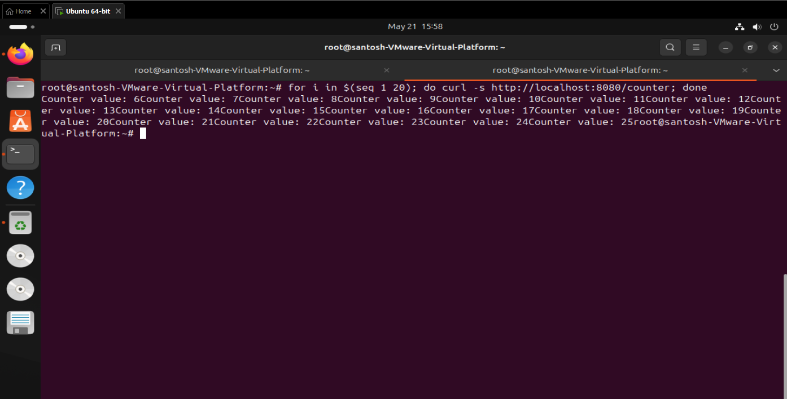
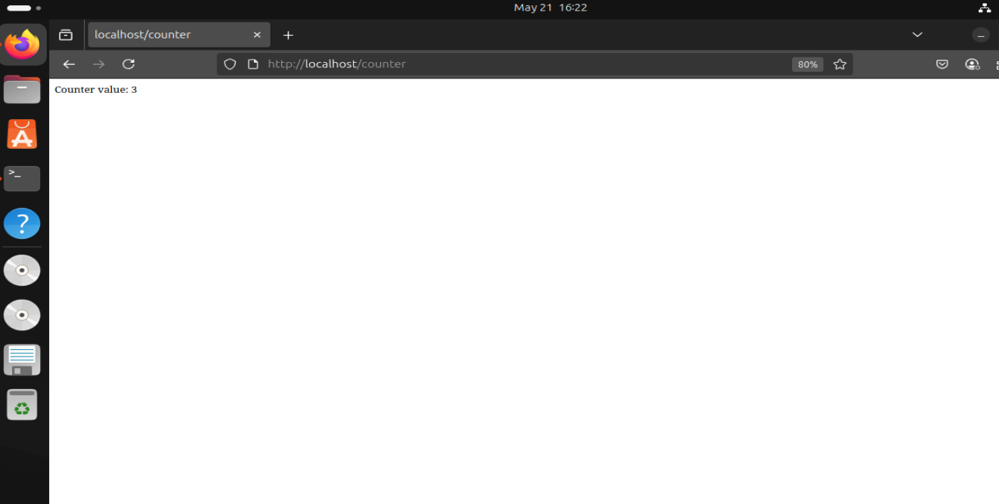